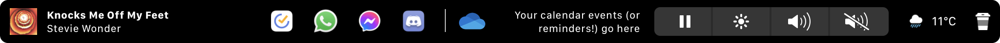

<h1 align="center">
    A customized (personalised) fork of EnergyBar 
</h1>

EnergyBar is an app which replaces native touchbar functionality with widgets. It is lighter and less resource-intensive than most existing alternatives currently (e.g: Pock, BTT).

This version of the app revamps the look of certain widgets to achieve a more minimal design.

## FAQs
### How do I toggle next/previous to skip tracks/music?
Touch and hold the play/pause button, then swipe left or right. The icon will change accordingly.

### How do I change keyboard brightness?
Working on it!

### Lock widget isn't working
Touch and hold the coffee icon.

### Access calendar from touchbar?
Touch and hold the events widget.

## Changes
### To-Do Widget
- Removed calendar icon
- Realigned to the right (instead of the centre)

### Now Playing Widget
- Added **album art support** (Spotify, Music, Podcasts etc.)       
    -  Added compatibility with Safari to show Safari icon
    -  Now displays appBundleID as a subtitle if no artist/appName is available
- Realigned to the left (instead of the centre)
- Removed long tap function

### Weather Widget
- Removed area information
- Changed font size and spacing

### Lock Widget
- Made widget smaller

### Control Widget
- Increased responsiveness
- Removed long touch function

### Dock
- Changed spacing and icon size

## To Do
- [x] Album Art support
- [x] Safari Now Playing support
- [x] Smoother control widget (removed long-press etc.)
- [x] Long-press lock widget (prevent accidental taps)
- [ ] To-do widget - get time + location info
- [ ] Add 2nd to-do widget, OR show 2 events in the same widget (Title **bold** current event, subtitle next event), look into the timing
- [ ] DND widget (need to look into observers for NSUserDefault)
- [x] Keyboard light adjustment
- [x] Reused function for dock space (the dock is seemingly not that useful...)

## Developer Notes

The project source code is organised as follows:

* :file_folder: [build/Xcode](build/Xcode): Xcode workspace
* :file_folder: [rsc](rsc): project resources
* :file_folder: [src](src): project sources
    * :file_folder: [src/System](src/System): macOS system sources
    * :file_folder: [src/Widgets](src/Widgets): widget sources
